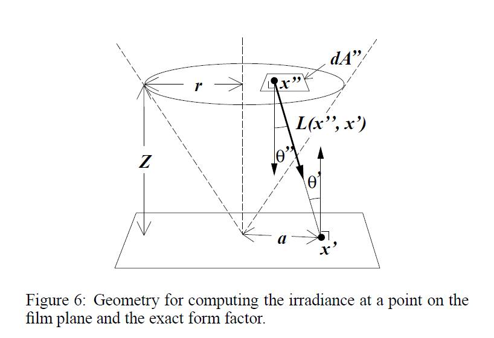

## Homework 2 ##

### Description of implementation approach and comments ###

* Windows 7 64-bits
* Comipler & IDE: Microsoft Visual Studio 2012
* Image View Software: IrfanView
* Intel(R) Core(TM) i5-3470 CPU @ 3.20GHz 3.20GHz
* Intel(R) HD Graphics 
* RAM 4.00 GB

### Ray Sphere Intersection ###

計算射線和球體的交點，可以參照 `/pbrt-v2/shapes/sphere.cpp` 中 `bool Shpere::Intersect()` 的算法。

假設球體圓心座標 $O$，射線單位向量 $I$ 的起點座標 $C$，且最近目標交點座標 $P$，原半徑 $\mathrm{radius}$。射線走單位時間 $t$ 會到達球面上。

* $\overrightarrow{OC} + \overrightarrow{I} \times t = \overrightarrow{OP}$
* $|\overrightarrow{OP}| = \text{radius}$
* $|\overrightarrow{OC} + \overrightarrow{I} \times t| = |\overrightarrow{OP}|$
* $|\overrightarrow{I}|^2 t^2 + 2 \; (\overrightarrow{OC} \cdot \overrightarrow{I}) \; t + |\overrightarrow{OC}|^2 - \text{radius}^2 = 0$

解一元二次方程式之後可以得到 $t$ 得值，並得到交點座標 $P$。

### Snell's Law ###

根據物理法則斯乃爾定律計算折射的方向向量，課程中提供三種做法。

變數解釋：入射介面材質 $\eta_1$，折射介面材質 $\eta_2$，入射單位向量 $\overrightarrow{I}$，交點面法向量 $\overrightarrow{N}$，折射方向向量 $\overrightarrow{T}$

特別小心 `ray->d = Normalize(ray->d)` 的處理，Heckbert's Method 計算維持在單位圓上，故不用做最後的正規化計算。

#### Whitted's Method ####

| $\sqrt{}$| $/$ | $\times$ | $+$ | compute |
|----------|-----|----------|-----|---------|
|          |  1  |          |     | $n = \eta_1 / \eta_2$       |
|  | 3 | 3 | 2 | $I' = I / (-I \cdot N)$ |
| | |  | 3 | $J = I' + N $|
| 1 | 1 | 8 | 5 | $\alpha = 1 / \sqrt{n^2(I' \cdot I') - (J \cdot J)}$|
| | | 3 | 3 | $T' = \alpha J - N$|
| 1 | 3 | 3 | 2 | $T' = T' / \| T' \| $ |
| 2 | 8 | 17 | 15 | TOTAL |

#### Heckbert's Method ####

| $\sqrt{}$| $/$ | $\times$ | $+$ | compute |
|----------|-----|----------|-----|---------|
|          |  1  |          |     | $\eta = \eta_1 / \eta_2$       |
|  |  | 3 | 2 | $c_1 = - I \cdot N$ |
| 1 | | 3 | 2 | $c_2 = \sqrt{1 - \eta^2(1 - c_1^2)}$ | 
| | | 7 | 4 | $T = \eta I + (\eta c_1 - c_2) N$|
| 1 | 1 | 13 | 8 | TOTAL |

#### Other Method ####

| $\sqrt{}$| $/$ | $\times$ | $+$ | compute |
|----------|-----|----------|-----|---------|
|          |  1  |          |     | $n = \eta_2 / \eta_1$  |
|  |  | 3 | 2 | $c_1 = - I \cdot N$ |
| 1 | | 2 | 3 | $\beta = c_1 \sqrt{n^2 - 1 + c_1^2} $ | 
| | 3 | 3 | 3 | $T = (I + \beta N ) / n$|
| 1 | 4 | 8 | 8 | TOTAL |

其中以 Heckbert's Method 消耗最少計算數。如果除法速度快於乘法，則使用 Other Method，原則上很少有機器運算除法比乘法快。

### RasterToCamera ###

這部分處理後得到 `Transform RasterToCamera`。若計算錯誤，會造成一片黑或者圖片顯示的大小問題。座標轉換處理細節可以參考實際的例子，如下圖所示：

* Raster-To-NDC 轉換矩陣 $A=\text{Scale}(scale, scale, 1)$，進行縮放。
* NDC-To-Camera 轉換矩陣 $B=\text{Translate}(Vector(0, 0, filedistance)) \times \text{Translate}(Vector(X, -Y, 0))$，進行位移。
* 最後得到 RasterToCamera 轉換矩陣 $C= B \times A \times \text{Scale}(-1, 1, 1)$，最後將 x 軸顛倒以符合成像問題。

### Ray Weight ###

作業要求經過 `float GenerateRay()` 回傳 $\mathrm{weight} = \frac{\cos^4 \theta'}{Z^2}$，這麼設置會過暗，根據論文 A Realistic Camera Model for Computer Graphics 中寫道

> If the exit pupil subtends a small solid angle from $x'$, $\theta'$ can be assumed to be constant and equal the angle between $x'$ and the center of the disk. This allows us to simplify $$E(x') = \int_{x'' \in D} L(x'', x') \frac{\cos \theta' \cos \theta''}{\| x'' - x'\|} dA''$$ to: $$E(x') = L \frac{A}{Z^2} \cos^4 \theta'$$
> where $Z$ is the axial distance from the film plane to the dist and $A$ is the area of the disk. 

因此需要額外乘上常數 $A$，其中 $A$ 是最裡層的透鏡面積，因為我們是根據最裡層的透鏡面做均勻取樣，得到 $A = \mathit{backLens.radius}^2 \pi$。

### Sampling ###

單位圓均勻取樣方法有以下兩種，而非均勻取樣的寫法可參照 Sample 3 (錯誤的做法參照) 出來的效果看出。

#### Sampling 1

採用內建函數 `CencentricSampleDisk()`，採用 A Low Distortion Map Between Disk and Square 論文中提到的方案，將一個正方形壓縮到一個圓形中。參照作法如下圖所示  

其中給定 $a, b$ 均勻分布 $[0, 1]$，則得到 $r = a, \; \phi = \frac{\pi}{4} \frac{b}{a}$，最後計算得到座標 $x = r \cos \phi, \; y = r \sin \phi$。

#### Sampling 2

採用教科書上提供，其中給定 $a, b$ 均勻分布 $[0, 1]$，令 $r = \sqrt{a}, \; \phi = 2 \pi b$，最後計算得到座標 $x = r \cos \phi, \; y = r \sin \phi$。

#### Sampling 3

給定 $a, b$ 均勻分布 $[0, 1]$，令 $r = a, \; \phi = 2 \pi b$，最後計算得到座標 $x = r \cos \phi, \; y = r \sin \phi$。這種寫法在相同半徑下，角度均勻分布，不同半徑下的周長與 $r$ 成正比，導致不同半徑的取樣點不均勻，越靠近中心點取樣越密集，意即容易造成中心點看起來較亮。

## Reference ##

* [PBRT学习笔记：在单位圆内部均匀采样 - 
codeboycjy的专栏](http://blog.csdn.net/codeboycjy/article/details/6225886)